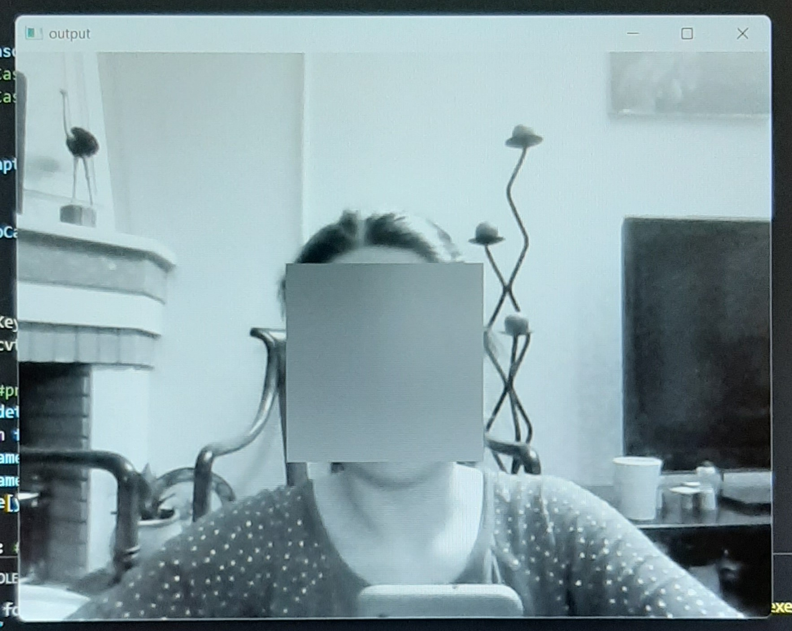
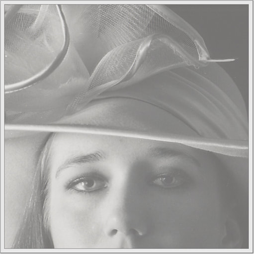
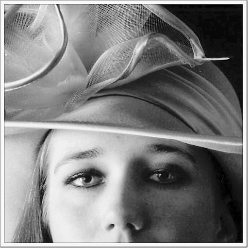
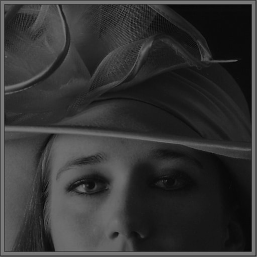
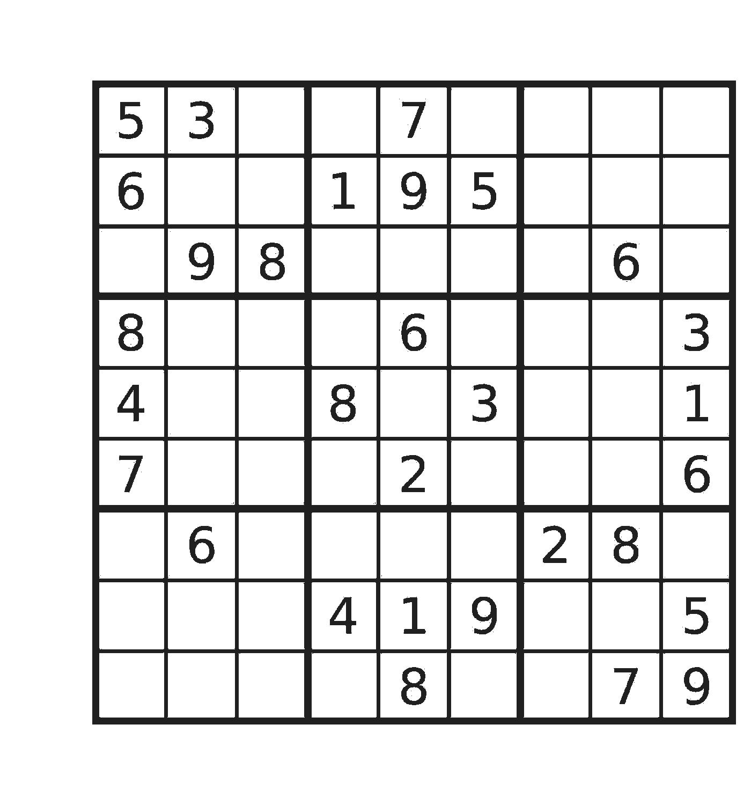
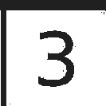
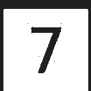

# image_processing5

## Part_1 :

on met un filtre flou sur les visages qui vont être détectés...

## Part_2 :

cela augmente le contraste de cadre du webcam et puis détermine la couleur qui est plus marqué entre ces trois(noir, blanc et gris)

## Part_3 :

j'ai utilisé d'autre façon au lieu de (cv2.equalizeHist) 
pour augmenter le contrast. et vous pouvez voir la difference :

image d'origin

(cv2.equalizeHist)

(cv2.convertScaleAbs(image, alpha=alpha, beta=beta))

---
## Part_4 :

il faut séparer les nombres dans la photo du Sudoku

### image d'entrée après avoir augmenté le contraste:

### la sortie:

Ce sont des petits photos qui comportent les nombres :

     ....
